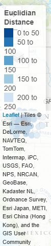

```{r, include = FALSE}
knitr::opts_chunk$set(
  collapse = TRUE,
  comment = "#>",
  fig.path = "man/figures/README-",
  out.width = 100
)
```

# weathR

<!-- badges: start -->
<!-- badges: end -->

The goal of this package is to facilitate easy interaction with the National Weather Service API in R!

## Installation

You can install the development version of weathR from [GitHub](https://github.com/) with:

``` r
# install.packages("devtools")
devtools::install_github("JeffreyFowler/weathR")
```

Or, you can get the official release version from CRAN:

``` r
install.packages("weathR")
```

## Fetching NWS Metadata for a Location

The function `point_data()` allows the user to fetch NWS metadata for a specific point as a dataframe.

```{r example1}
library(weathR)
library(dplyr)
library(sf) #This is used later in our documentation

# Using google maps, we find the coordinates for Central Park, NYC.
point_data(lat = 40.768472897200986, lon = -73.97600351884695) %>% 
  as.data.frame() %>% 
  head()

```

## Fetching and Displaying Point Forecasts

```{r example2}

# We can fetch forecast temperatures (in degrees fahrenheit) for NYC
point_forecast(lat = 40.768472897200986, lon = -73.97600351884695) %>% 
  as.data.frame() %>% 
  select(time, temp) %>% 
  head()

# We can even produce a graph of the forecast
library(ggplot2)

point_forecast(lat = 40.768472897200986, lon = -73.97600351884695) %>% 
  as.data.frame() %>% 
  select(time, temp) %>% 
  mutate(time = as.POSIXct(time)) %>% #convert time to a POSIXct object 
  ggplot(aes(x = time, y = temp)) +
  #Add points for forecast values of temperature
  geom_point(color = "brown") +
  #Add a smoothed line that follows the points
  geom_smooth(method = "loess", span = .15, se = FALSE, color = "indianred") +
  labs(
    title = paste0("KNYC Temperature Forecasts for the Week of ", Sys.Date()),
    y = "Temperature (Degrees Fahrenheit)",
    x = "Day"
  ) +
  theme_minimal()

```

## Fetching Station ID forecast values

Rather than using a latitude/longitude point, we can use an ASOS or AWOS station identifier.

Lets get a list of the forecast wind speed, wind direction, and skies, by time.

```{r example3, message=FALSE, warning=FALSE}

station_forecast(station_id = "KNYC") %>% 
  as.data.frame() %>% 
  select(time, wind_speed, skies) %>% 
  head()

# We can easily put this result into a GT table for easy viewing
```

```{r gtexample, message=FALSE, warning=FALSE, results='hide'}
library(gt)

station_forecast(station_id = "KNYC") %>% 
  as.data.frame() %>% 
  select(time, wind_dir, wind_speed, skies) %>% 
  filter(dplyr::row_number() == 1 | skies != lag(skies)) %>%  #Keep only observations where the first row is 0 and the skies change
  rename_with(~ gsub("_", " ", .) %>% stringr::str_to_title()) %>% #switch from snake_case to Title Case
  gt::gt() %>% 
  gt::tab_header(title = paste0("Skies forecast for KNYC, the Week of ", Sys.Date())) %>% 
  gt::opt_css(css = "")

```


## Finding NWS ASOS/AWOS Stations Near a Point

There a number of different types of weather stations. An advantage of the weathR package is the ability to easily find ASOS/AWOS stations used the NWS near a given point. This is useful as these stations tend to have better quality assurance practices than amateur meteorologist stations.

```{r example4}

#Using the coordinates for Denver, Colorado from google maps
stations_near(lat = 39.73331998845491, lon = -104.98209127042489) %>% 
  as.data.frame() %>% 
  head()

#Or, viewing them plotted on an interactive map
library(tmap)
tmap::tmap_mode("view")
tmap::tmap_options(basemaps = c(Topo = "Esri.WorldTopoMap"))

stations_near(lat = 39.73331998845491, lon = -104.98209127042489) %>% 
  tmap::tm_shape() + 
  #Plot stations near our point, with color becoming darker as they get closer
  tmap::tm_dots(size = .08, col = "euc_dist", palette = "-Blues", title = "Euclidian Distance") +
  tmap::tm_shape(
    st_as_sf(
      data.frame(
        lon = -104.98209127042489,
        lat = 39.73331998845491
      ),
      coords = c("lon", "lat"),
      crs = 4326
    )
  ) +
  tmap::tm_dots(size = .08)

```
[You can click here to view the dynamic map we created.](https://jeffreyfowler.github.io/weathR/dynamic_map.html)

This is just a sampling of the functionality available in this package. Feel free to browse the documentation with the `?function` commands in the R console to explore further!
